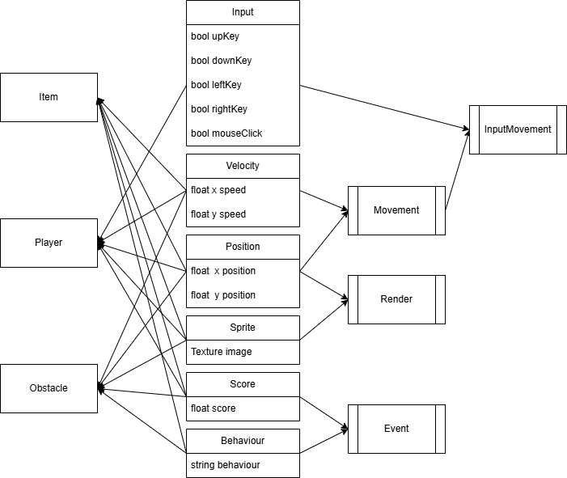
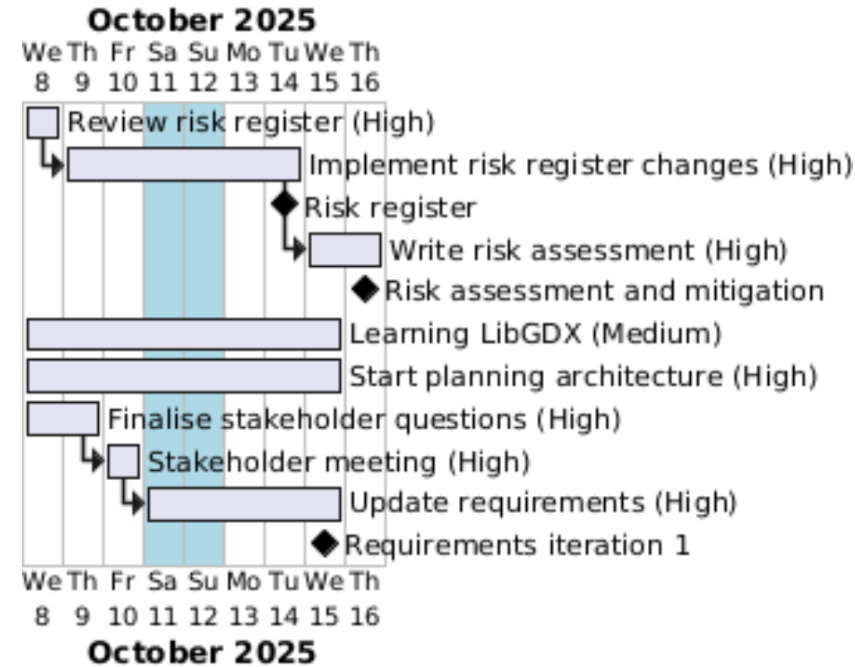
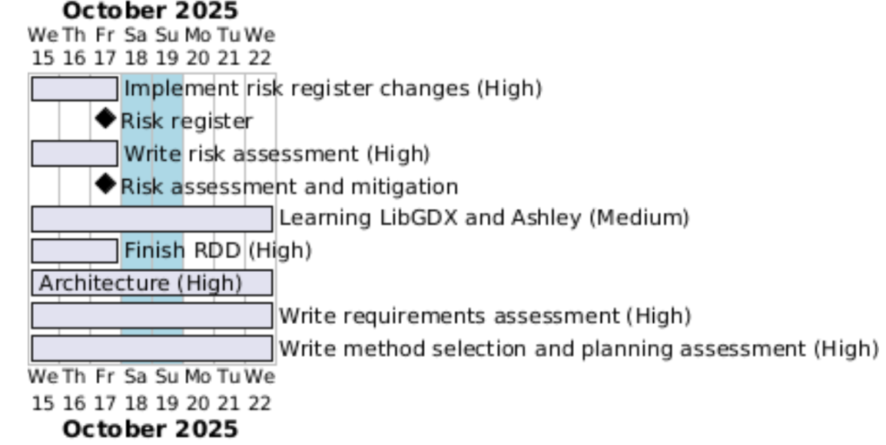
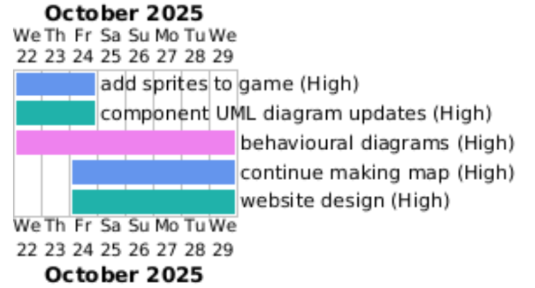
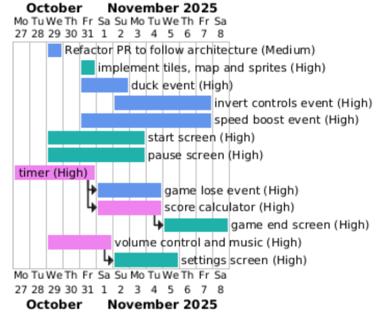
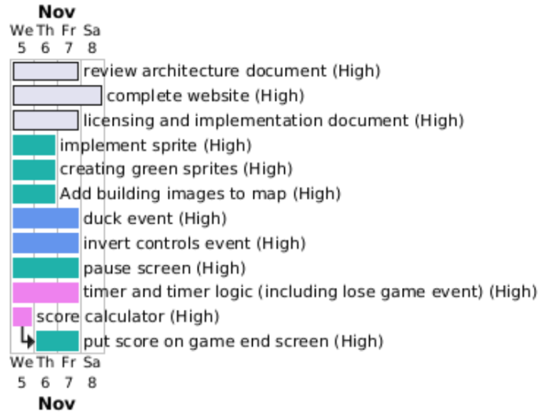
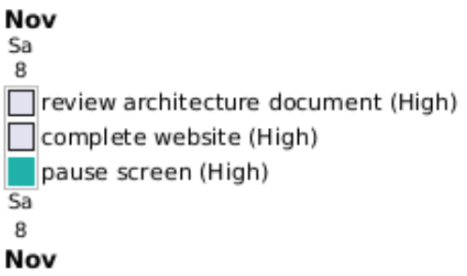

Home of Team 5's Engineering 1 project.

## Contents
* [Deliverables](https://ksd540.github.io/lizzardentertainment/#deliverables)
* [Our Game](https://ksd540.github.io/lizzardentertainment/#our-game)
* [Version Control Repository](https://ksd540.github.io/lizzardentertainment/#version-control-repository)
* [Additional Content](https://ksd540.github.io/lizzardentertainment/#additional-content)

## Deliverables
[Requirements](assets/deliverables/Req1.pdf)\
[Architecture](assets/deliverables/Arch1.pdf)\
[Method selection and planning](assets/deliverables/Plan1.pdf)\
[Risk assessment and mitigation](assets/deliverables/Risk1.pdf)\
[Implementation](assets/deliverables/Impl1.pdf)

## Our Game
You can download and play our game [here](assets/UoYMaze.jar).

## Version Control Repository
[This](https://github.com/ksd540/eng1-project) is where all our project files, with a complete history of changes, are located.

## Additional Content

* [Requirements](https://ksd540.github.io/lizzardentertainment/#requirements) 
    * [Stakeholder interview questions](https://ksd540.github.io/lizzardentertainment/#stakeholder-interview-questions) 

* [Architecture](https://ksd540.github.io/lizzardentertainment/#architecture) 
    * [Prototype ECS diagram](https://ksd540.github.io/lizzardentertainment/#prototype-ecs-diagram) 
    * [Prototype component diagrams](https://ksd540.github.io/lizzardentertainment/#prototype-component-diagrams) 
    * [CRC cards](https://ksd540.github.io/lizzardentertainment/#crc-cards)
    * [Methods and Functions]((https://ksd540.github.io/lizzardentertainment/#methods-and-functions))

* [Method selection and planning](https://ksd540.github.io/lizzardentertainment/#method-selection-and-planning)
    * [Weekly Gantt Chart Diagrams](https://ksd540.github.io/lizzardentertainment/#weekly-gantt-chart-diagrams)

### Requirements
#### Stakeholder Interview Questions
Our Stakeholder Interview Questions can be found [here](assets/Stakeholder%20Interview%20Questions.pdf).

### Architecture
#### Prototype ECS diagram

#### Prototype component diagrams

#### CRC cards
The team broke down our game by creating physical CRC cards (see below). A typed up version of all the cards can be found [here](assets/CRC%20Cards.pdf).
\

#### Methods and Functions

### Method selection and planning
#### Weekly Gantt Chart Diagrams

